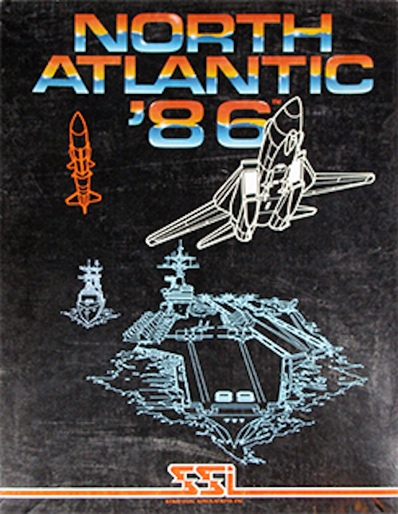
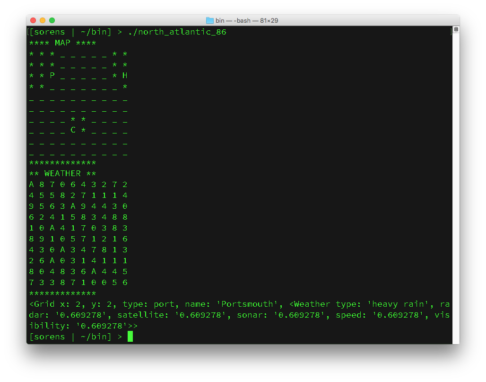
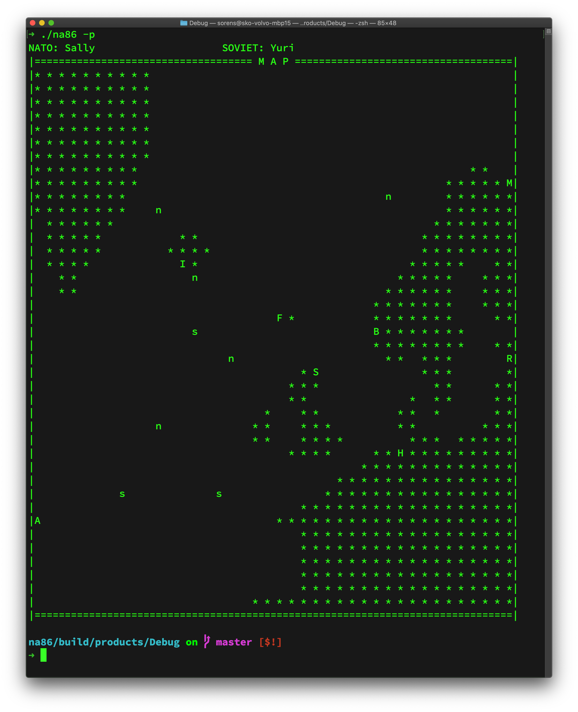
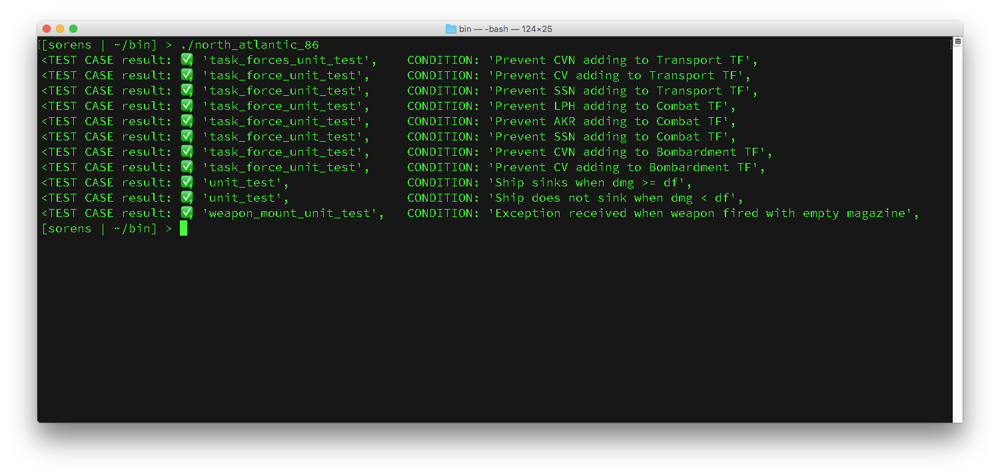

# North Atlantic 86 Simulation Library

## Original Game

The original game, [North Atlantic '86](https://northatlantic86.com), was released in 1983 by the great game creator, Gary Grigsby. The game featured two player (NATO v USSR) or a human player (NATO) against a computer player (USSR). The two players battled for control of the North Atlantic. The goal of the NATO player was to keep the sea lanes open and keep its allies in Europe supplied. The USSR goal was to deny the supplies to the British Isles, eliminate the thread to its naval forces at Iceland and the Faroes so that it coule operate uncontested in the North Atlantic. Game play included landing paratroopers, shore bombardment from battleships, carrier battle groups and countless warnings of "Incoming Vampires!". It was great fun to play!



## Summary

I needed a reason to practice coding and re-creating this game was more fun than the various coding exercises. The requirements:

1. Employ good coding practices
1. The game should be playable
1. Document in Github at https://github.com/sorens/na86

This game project is broken into four chief components:

1. the data necessary to drive the game (IN_PROGRESS)
1. the game engine to prosecute the moves
1. the user interface that allows the player to play the game
1. the artificial intelligence engine to conduct the opponents moves

## Game

The game object will be constructed from a factory method that allows clients to inject the layout of the game board. The game will include APIs to start() and return the map(). The start() API will trigger random weather patterns that will update the map on each turn.

```c++
// Create a game object using the MapSetup vector. See MapSetup below
std::shared_ptr<Game> game = Game::Make(std::vector<std::shared_ptr<MapSetup>> 
    map_data, const std::string &ships_file, const std::string &weapons_file);
```

```c++
// Ask the game object for the current map
std::shared<Map> map = game->map();
```

```c++
// Advance the game one turn. Each turn is half of a day
game->next_turn();
```

```c++
// Return the string representation of the current time (e.g. which turn is it)
std::string game->current_time();

// e.g. 15 SEP 1986 AM
```

## Map
    
Clients will inject an array that places the landmass, bases and ocean. The API will provide the client with the ability to query each grid on the map to determine all the characteristics of that grid at that time.

```c++
// Ask the map for the Grid object using 0-based x and y coordinates
// x and y can not be less than 0 and can not be greater than N where
// NxN is the length of the array used to create the Map. All maps are
// square. Requesting a Grid object outside of the bounds will throw a
// MapOutOfBoundsException.
std::shared_ptr<Grid> grid = map->at(int x, int y);
```

```c++
// Return a description of the Grid object
auto portsmouth = game->map()->at(2, 2);
std::cout << portsmouth->description() << std::endl;3

// e.g. <Grid x: 2, y: 2, type: port, name: 'Portsmouth', 
// <Weather type: 'gale', radar: '0.0706602', satellite: 
// '0.0706602', sonar: '0.0706602', speed: '0.0706602', visibility: '0.0706602'>>
```

```c++
auto ocean = map->at(5, 4);
std::cout << "water_temperature at (5, 4): " << ocean->water_temperature() << std::endl;

// e.g. water_temperature at (5, 4): 42
```

```c++
// Return a list of the units at a coordinate. 
// Throws MapOutOfBoundsException
std::vector<std::shared_ptr<Unit>> map->units(int x, int y);
```

## MapSetup

To create a game board, clients specify the map by creating an array that is a multiple N. Each element contains a `MapSetup` object that helps the game engine create the map. Each MapSetup object will contain information about that location (landmass, ocean, airbase or port). If there is an airbase or port, the `MapSetup` will also include a 32 character name. The grid will be a square expressed as an array. If you want a 10x10 grid, then your array should contain 100 elements.

The data should be encoded in a JSON object.

Grid Type:

0: landmass
1: ocean
2: airbase
3: port

```javascript
{
    "map": [0, 0, 0, 1, 1, 1, 1, 1, 0, 0,
    0, 0, 0, 1, 1, 1, 1, 1, 0, 0,
    0, 0, 3, 1, 1, 1, 1, 1, 0, 2,
    0, 0, 1, 1, 1, 1, 1, 1, 1, 0,
    1, 1, 1, 1, 1, 1, 1, 1, 1, 1,
    1, 1, 1, 1, 1, 1, 1, 1, 1, 1,
    1, 1, 1, 1, 0, 0, 1, 1, 1, 1,
    1, 1, 1, 1, 2, 0, 1, 1, 1, 1,
    1, 1, 1, 1, 1, 1, 1, 1, 1, 1,
    1, 1, 1, 1, 1, 1, 1, 1, 1, 1],
    "names": ["Portsmouth", 
    "Halifax",
    "Centersville"]
}
```

Note: The names of the airbases and ports will follow the grid array and should be listed in the order that they are encountered in the grid array.

The above example should create a map that looks like this:

```
* * * _ _ _ _ _ * *
* * * _ _ _ _ _ * *
* * P _ _ _ _ _ * H
* * _ _ _ _ _ _ _ *
_ _ _ _ _ _ _ _ _ _
_ _ _ _ _ _ _ _ _ _
_ _ _ _ * * _ _ _ _
_ _ _ _ C * _ _ _ _
_ _ _ _ _ _ _ _ _ _
_ _ _ _ _ _ _ _ _ _

```

```
*: landmass
_: ocean
P: Portsmouth port
H: Halifax airbase
C: Centersvill airbase
```

```c++
// Create the MapSetup vector using JSON
std::vector<std::shared_ptr<MapSetup>> MapSetup::factory(const std::string json_import)
```

## Weather

The game will include weather fronts and water termperatures that will affect detection performance, weapon effectiveness and sortie capabilities.

```c++
// ask for the current weather at a particular coordinate
auto weather = grid->weather();
auto radar_modifier = weather->radar_modifier();
    // e.g. a float between 0 and 1
auto weather_type = weather->type();
    // e.g. Gale, Clear, etc
```

## Unit and MutableUnit

A unit will describe a ship, an aircraft or a port/airbase. Each unit will have different characteristics. Ships can move, Aircraft remain fixed to a ship or base but can attack and defend if scrambled, ports and airbases have aircraft, troops and supplies. A unit will be defined via inheritance and composition. A MutableUnit will allow the game to modify certain fields of a unit as the game progress (e.g. damage)

## ShipData

A ShipData class will load the read-only ship from JSON data so that the game object will have access to all the fields of each ship.

## WeaponSystem and WeaponMount

Each Weapon System in the game will be backed by a read-only object loaded from JSON data. Weapon Mounts will be created on each of the units with a reference to the WeaponSystem it employs. Weapon Mounts will track magazine size, salvo rate, etc.

## Task Force

A Task Force is comprised of one or more units from the same navy. Each navy can put to sea Task Forces with the mission type: COMBAT, BOMBARDMENT, TRANSPORT, EVACUATION or SUBMARINE. A sixth mission type, RETURN, is used when a Task Force can no longer fufill its original mission.

## Example



An early look at what the game map for the North Atlantic



Some initial unit tests


